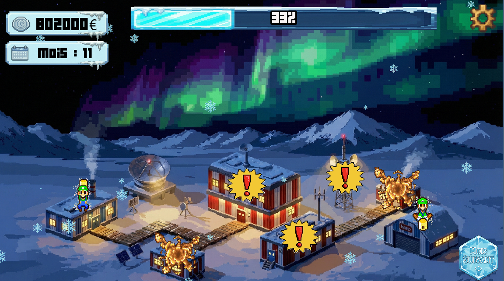

# ❄️ Glacia

**Glacia** est un jeu de **gestion, de survie et de recherche** en Antarctique, développé avec **Godot Engine**.  
Le joueur doit gérer une station scientifique composée de **8 bâtiments**, maintenir le **moral** et la **population** des scientifiques, et faire face aux conditions extrêmes.

---

🎮 Jouer au jeu

👉 https://miterra.itch.io/glacia

---

## 📘 Description & Pédagogie

Cette section détaille la vision globale du jeu et ses intentions éducatives.

### 🎓 Objectifs pédagogiques
Ce projet vise à développer des compétences clés en gestion de projet et en prise de décision :
* **Gestion de ressources limitées :** Apprendre à optimiser un budget fini (160 000 €) face à des besoins de maintenance constants.
* **Anticipation et Planification :** Comprendre l'impact des délais (livraison à 5 mois) et se préparer aux changements drastiques d'environnement (cycle jour/nuit).
* **Équilibre systémique :** Maintenir l'harmonie entre trois variables interdépendantes : la population, l'état matériel des bâtiments et le moral de l'équipe.

### 🕹️ Genre et Style
**Glacia** est un jeu de **simulation et de stratégie en 2D** au style "Pixel Art / Interface". L'esthétique est froide et clinique, rappelant les tableaux de bord de gestion, pour immerger le joueur dans le rôle d'un administrateur de station isolé face à la rudesse de l'Antarctique.

### 🎮 Modes de Jeu
Le joueur peut choisir entre deux approches au démarrage :
* **Mode Normal :** Survivre 24 mois (Objectif de fin).
* **Mode Infini :** Survivre le plus longtemps possible (High Score).


### 🖱️ Actions du joueur
Le joueur agit en tant que chef de station via plusieurs leviers :
* **Répartition des effectifs :** Déplacer les scientifiques dans les bâtiments prioritaires pour freiner leur dégradation.
* **Gestion financière :** Commander des ressources de réparation au bon moment.
* **Arbitrage de crise :** Décider quels bâtiments sacrifier lorsque la population chute en mode nuit.

### 📉 Informations renvoyées au joueur (Feedback)
Le système communique l'état de la simulation via des indicateurs visuels clairs :
* **Jauges d'état (%) :** Indiquent la santé structurelle de chaque bâtiment (Codes couleurs : 🟢 Bon, 🟠 Moyen, 🔴 Critique).
* **Barre de Moral :** Feedback immédiat sur la qualité de la gestion (Si le moral atteint 0, la partie est perdue).
* **Alertes visuelles :** Icônes d'avertissement lorsqu'un bâtiment passe sous les 50% ou manque de personnel.

---

## 🎯 Objectifs du jeu
- Survie et gestion de la population scientifique  
- Gestion du **moral** et de l’état des bâtiments  
- Optimisation des **ressources financières** pour réparer et maintenir les bâtiments  
- Anticipation du mode **jour → nuit** après 6 mois, où la population chute drastiquement  

---

## 🏢 Bâtiments & Gestion du Personnel

La gestion du personnel influence directement l'état des bâtiments à chaque tour. La précision est la clé :

| Population | Effet sur l'état | Description |
| :---: | :---: | :--- |
| **0 – 4** | 🛑 **DANGER (-10%)** | Dégradation critique et rapide. |
| **5 – 9** | ⚠️ **Usure (-5%)** | Le bâtiment s'abîme lentement. |
| **10 – 14** | ⚖️ **Stabilité** | L'état ne bouge pas. |
| **15 – 19** | 🔧 **Entretien (+5%)** | Le bâtiment est réparé doucement. |
| **20 +** | ✅ **Rénovation (+20%)** | Réparation très rapide. |

> ⚠️ Si un bâtiment est <50% après un mois → **moral -1%** 

---

## 📊 Moral / Barre de survie
- Valeur initiale : **100%** - Baisse si des bâtiments sont mal gérés  
- **Moral = 0 → Game Over** 🚨  



---

## 👥 Population
- Population totale : **50 personnes** réparties dans les bâtiments  
- Après 6 mois → **mode nuit** : population totale = **10** - Importance : maintenir la population pour éviter la dégradation des bâtiments  

---

## 💰 Budget et ressources
- Budget : **20 000 € par bâtiment / mois** → 160 000 € total  
- Achat de ressources pour **réparer les bâtiments détruits (0%)** - Livraison : **5 mois après l’achat** - Après livraison → bâtiment réparé ✅  


---

## 🏁 Fin de Partie

Le jeu propose un écran récapitulatif détaillé à la fin de la session (Victoire ou Défaite), affichant le score, l'argent économisé et l'état final des bâtiments.

### ✅ Victoire (Mission Réussie)
En mode normal, atteindre le 24ème mois avec un moral positif.


### ❌ Game Over (Station Gelée)
Si la barre de survie tombe à 0%.


---

## 🖥️ Interface
- Barre de chaque bâtiment indiquant l’état (%)  
- Barre globale indiquant le **moral** - Indicateur de population par bâtiment  
- 🔴 Alerte si bâtiment <50% ou population trop faible  
- ⏳ Compteur de livraison de ressources  

---

## ⚙️ Contraintes techniques
- Développement avec **Godot Engine** - Jeu en 2D, type **simulation de station scientifique** - Sauvegarde automatique mensuelle de l’état  
- Simulation mensuelle pour les bâtiments et le moral  

---

## 🎮 Stratégie
- Répartir la population de manière optimale  
- Planifier le budget pour anticiper les réparations (livraison 5 mois plus tard)  
- Préparer le **mode nuit** pour maintenir le moral  

---

## 👥 Équipe
- **Halil Bronja** : développement Godot, gestion des bâtiments et du moral  
- **Matteo Stroher** : ressources, interface et design graphique  
- **Victor Hatt** : ancien membre, plus actif  

---

## 🚀 Améliorations futures
- Événements aléatoires : tempêtes, pannes, maladies 🌪️❄️🦠  
- Niveaux de difficulté ou modes de jeu alternatifs  
- Amélioration de l’interface et animations pour le moral et les bâtiments  

---

## 📅 Timeline / Gestion des mois
| Mois | Population totale | Événements |
|------|-----------------|-----------|
| 1–5  | 50               | Normal |
| 6    | 10               | Mode nuit, difficultés augmentées |
| 7+   | Variable         | Survie critique, gestion des ressources essentielles |

---

# Glacia - Installation et lancement

Glacia est un jeu développé avec Godot. Ce guide explique comment l’installer et le lancer selon votre système d’exploitation.

---

## Windows

1. Télécharger l’installateur Windows depuis GitLab : `GlaciaInstaller.exe`.
2. Double-cliquer sur le fichier pour lancer l’installation.
3. Choisir le dossier d’installation (par défaut : `C:\Program Files (x86)\Glacia`).
4. Une fois installé, lancer `Glacia.exe` depuis le raccourci ou le dossier d’installation.

---

## macOS

**Note :** pas encore de binaire natif macOS. Le jeu fonctionne via **Wine**.

### Étape 1 : Installer Homebrew (si non installé)

```bash
/bin/bash -c "$(curl -fsSL https://raw.githubusercontent.com/Homebrew/install/HEAD/install.sh)"
```

Ajouter Homebrew au PATH :

- Apple Silicon (M1/M2/M3) :
  ```bash
  echo 'eval "$(/opt/homebrew/bin/brew shellenv)"' >> ~/.zprofile
  eval "$(/opt/homebrew/bin/brew shellenv)"
  ```
- Intel :
  ```bash
  echo 'eval "$(/usr/local/bin/brew shellenv)"' >> ~/.zprofile
  eval "$(/usr/local/bin/brew shellenv)"
  ```

Vérifier l’installation :

```bash
brew --version
```

### Étape 2 : Installer Wine

```bash
brew install --cask wine-stable
```

### Étape 3 : Télécharger la version Windows du jeu

- `Glacia.exe`
- `Glacia.pck`

### Étape 4 : Lancer le jeu

Dans le Terminal, naviguer jusqu’au dossier contenant `Glacia.exe` et `Glacia.pck` :

```bash
cd /chemin/vers/le/dossier
wine Glacia.exe
```

⚠️ La première fois, un clic droit → Ouvrir peut être nécessaire pour autoriser Wine à exécuter le jeu.

---

## Linux

Les fichiers Linux sont dans `exports/linux` sur GitLab : `Glacia_linux.exe.x86_64`, `Glacia_linux.exe.pck` et `script .sh`.

### Étape 1 : Récupérer les fichiers
- Télécharger le dossier `exports/linux` ou ces trois fichiers dans un même répertoire (ex. `~/Downloads`).

### Étape 2 : Rendre le script exécutable

```bash
cd ~/Downloads
chmod +x 'script .sh'
```

### Étape 3 : Installer le jeu

```bash
./'script .sh'
```

Le script installe Glacia dans `~/Glacia` (ou affiche le chemin exact) et crée un script de lancement `run.sh`. Il peut aussi ajouter une commande `Glacia` si le script la propose.

### Étape 4 : Lancer le jeu

```bash
~/Glacia/run.sh
```

Si le script a ajouté la commande système, vous pouvez simplement taper :

```bash
Glacia
```

> Si vous voyez “Permission non accordée” en lançant le script, vérifiez que l’étape `chmod +x 'script .sh'` a bien été faite.

---
