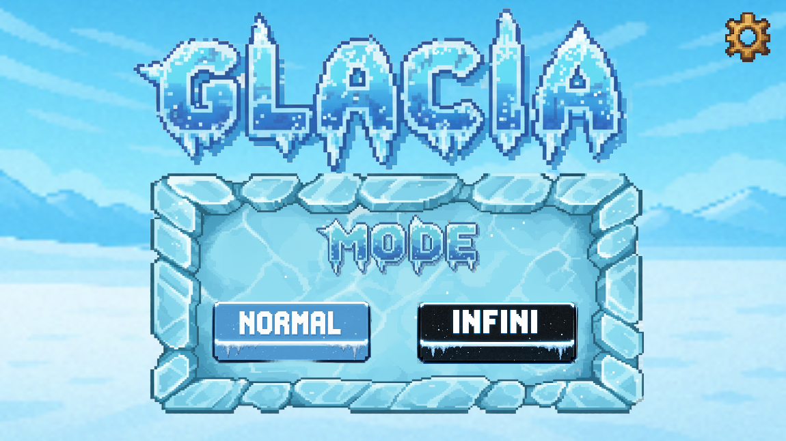
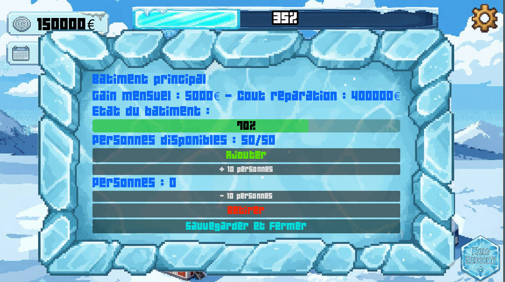
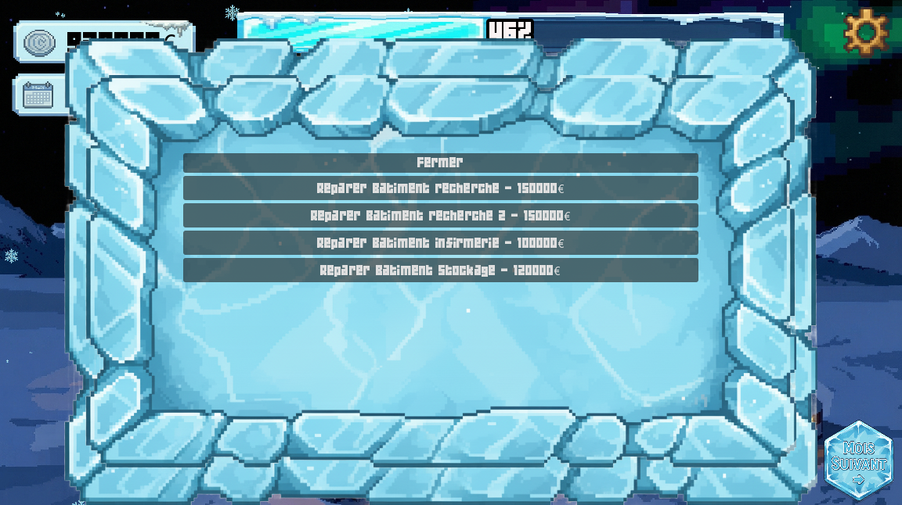
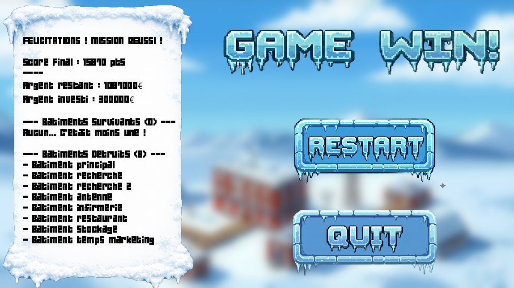
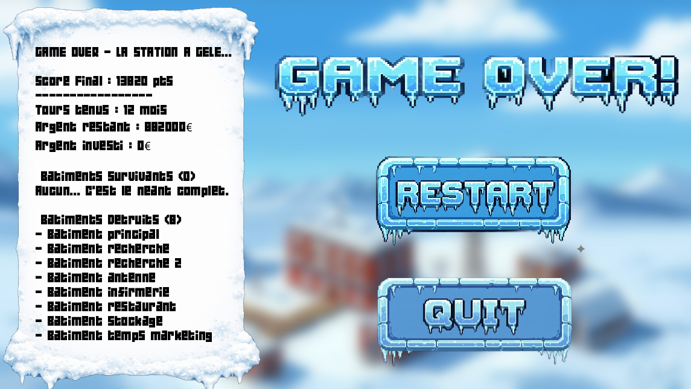

# ❄️ Glacia


> **Glacia** est un jeu de gestion, de survie et de stratégie en Antarctique.

En tant qu'administrateur d'une station isolée, vous devez gérer **8 bâtiments** vitaux, maintenir le **moral** de vos scientifiques et survivre aux conditions extrêmes du pôle Sud.

---

<p align="center">
  <a href="https://miterra.itch.io/glacia">
    
  </a>
</p>

---

## 📘 À propos du projet

### 🎓 Objectifs pédagogiques
Ce projet explore les dynamiques de gestion de crise :
* **Anticipation :** Gestion des délais de livraison (5 mois d'attente).
* **Équilibre systémique :** Interdépendance entre Population ↔ État des bâtiments ↔ Moral.

### 🕹️ Style & Ambiance
Une esthétique "Pixel Art / Interface Clinique" froide, conçue pour immerger le joueur dans le rôle d'un administrateur face à un tableau de bord.

---

## 🎮 Mécaniques de Jeu

### 1. Modes de Jeu

* **Mode Normal :** Objectif de survie sur **24 mois**.
* **Mode Infini :** Score attack (survivre le plus longtemps possible).

### 2. Le Cycle Jour / Nuit
* **Mois 1 à 5 (Jour) :** Population complète (**50** personnes). C'est le moment de préparer les réserves.
* **Mois 6+ (Nuit Polaire) :** La population chute à **10** personnes. La maintenance devient critique et le moral fragile.

### 3. Gestion des Bâtiments & Personnel
Votre main d'œuvre est votre ressource la plus précieuse. Le nombre de personnes affectées à un bâtiment détermine son usure ou sa réparation :

| Population | Effet sur l'état | Description |
| :---: | :---: | :--- |
| **0 – 4** | 🛑 **DANGER (-10%)** | Dégradation critique et rapide. |
| **5 – 9** | ⚠️ **Usure (-5%)** | Le bâtiment s'abîme lentement. |
| **10 – 14** | ⚖️ **Stabilité** | L'état ne bouge pas. |
| **15 – 19** | 🔧 **Entretien (+5%)** | Le bâtiment est réparé doucement. |
| **20 +** | ✅ **Rénovation (+10%)** | Réparation rapide. |

> ⚠️ **Alerte :** Si un bâtiment passe sous **50%** d'état, le moral global chute de **-1%** par tour.
> 

### 4. Budget & Logistique
* **Budget Total :** 160 000 € de base + l'argent accumulé par chaque batiments en fonction de ce qu'il génere par mois .
* **Réparations :** Vous pouvez commander des matériaux pour réparer instantanément un bâtiment détruit.
* **Délai :** La livraison prend **5 mois**. Il faut anticiper les pannes bien avant qu'elles n'arrivent !



---

## 🚦 Conditions de Victoire / Défaite

### ✅ Victoire
Atteindre le **24ème mois** avec un moral positif (en Mode Normal).


### ❌ Game Over
La partie s'arrête immédiatement si le **Moral (Barre de survie)** tombe à **0%**.


---

## 🚀 Installation & Lancement

### Windows 🪟
1. Téléchargez `GlaciaInstaller.exe` depuis les [Releases](https://github.com/mattow02/Glacia/releases).
2. Lancez l'installation (Dossier par défaut : `C:\Program Files (x86)\Glacia`).
3. Lancez le jeu via le raccourci `Glacia.exe`.

### Linux 🐧
Les fichiers se trouvent dans `exports/linux`.
1. Téléchargez le dossier ou les fichiers (`Glacia_linux.exe.x86_64`, `.pck` et le script `.sh`).
2. Rendez le script d'installation exécutable et lancez-le :
3. ```bash
   chmod +x 'script .sh'
   ./'script .sh'

```

3. Lancez le jeu :
```bash
~/Glacia/run.sh
# Ou simplement :
Glacia

```


### macOS 🍎

*Pas de version native. Utilisation via Wine.*

1. **Installer Homebrew** (si nécessaire) :
```bash
/bin/bash -c "$(curl -fsSL [https://raw.githubusercontent.com/Homebrew/install/HEAD/install.sh](https://raw.githubusercontent.com/Homebrew/install/HEAD/install.sh))"

```


2. **Installer Wine** :
```bash
brew install --cask wine-stable

```


3. **Lancer le jeu** (avec la version Windows `.exe`) :
```bash
cd /chemin/vers/le/dossier/Glacia
wine Glacia.exe

```


---

## 👥 Équipe

* **Matteo Stroher** ([@mattow02](https://github.com/mattow02)) : Ressources, UI/UX, Design Graphique.
* **Halil Bronja** : ([@Miterra](https://github.com/Miterra)) Développement Godot (Core), Gestion Bâtiments & Moral.


---

*Développé avec Godot Engine.*
