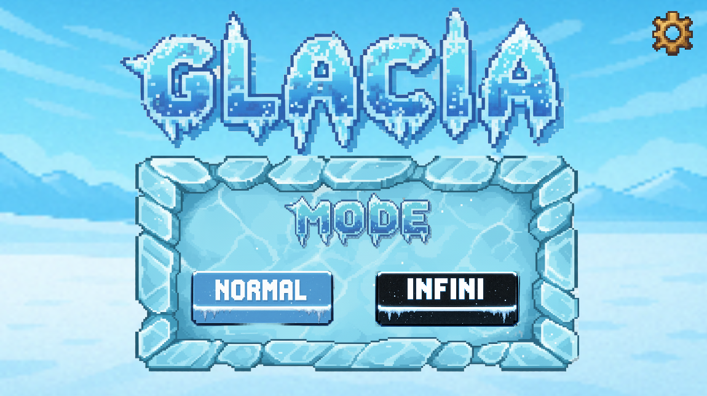
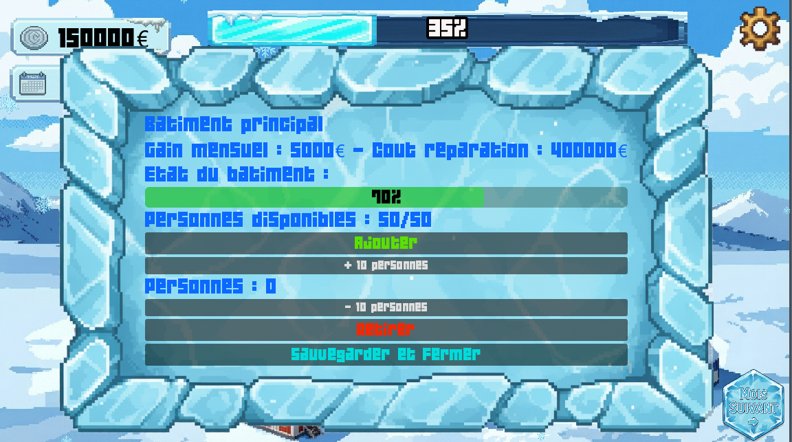
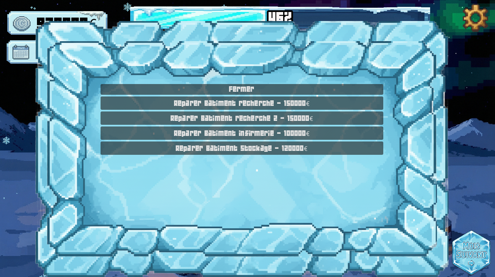
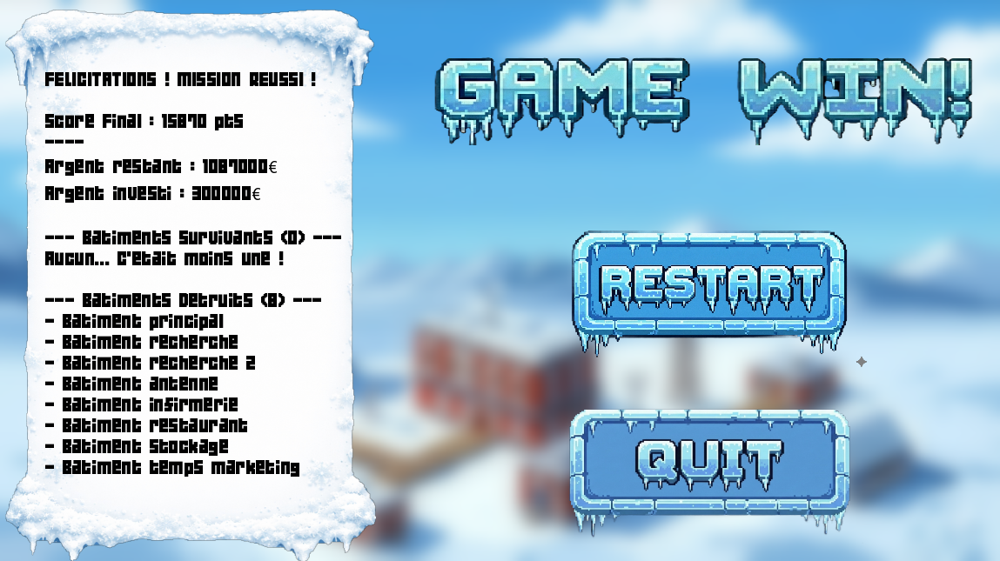
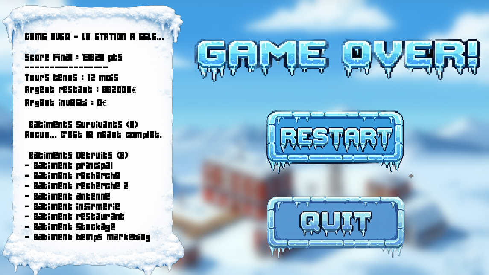

# Glacia


A survival and management game set in Antarctica. You run an isolated research station — manage 8 buildings, keep your crew's morale up, and survive the polar night.

<p align="center">
  <a href="https://miterra.itch.io/glacia">
    
  </a>
</p>

---

## Gameplay

### Game modes



- **Normal** — survive 24 months with positive morale to win.
- **Infinite** — score attack, survive as long as you can.

### Day / night cycle

- **Months 1–5 (daylight):** full crew of 50. Stock up and repair.
- **Month 6+ (polar night):** crew drops to 10. Maintenance becomes critical, morale is fragile.

### Building management

Assign crew members to buildings. Staffing level determines whether a building degrades or gets repaired:

| Crew | Effect | Description |
|:---:|:---:|:---|
| 0–4 | -10% | Critical degradation |
| 5–9 | -5% | Slow decay |
| 10–14 | 0% | Stable |
| 15–19 | +5% | Slow repair |
| 20+ | +10% | Fast repair |

If any building drops below 50%, global morale takes a -1% hit per turn.



### Budget and logistics

- Base budget of €160,000 plus monthly income from active buildings.
- Order repair materials for destroyed buildings — delivery takes 5 months, so plan ahead.



### Win / lose

- **Win:** reach month 24 with positive morale (Normal mode).
- **Game over:** morale hits 0%.




---

## Installation

### Windows

1. Download `GlaciaInstaller.exe` from [Releases](https://github.com/mattow02/Glacia/releases).
2. Run the installer.
3. Launch `Glacia.exe`.

### Linux

1. Download `Glacia_Linux.zip` from Releases.
2. Extract and run:

```bash
chmod +x 'script .sh'
./'script .sh'
~/Glacia/run.sh
```

---

## Tech stack

- **Engine:** Godot 4.5 (GDScript)
- **Art:** Pixel art / clinical dashboard aesthetic
- **Music:** Toby Fox (Undertale) — used for non-commercial/educational purposes only

---

## License

Source code is MIT licensed. All trademarks and copyrights belong to their respective owners.
